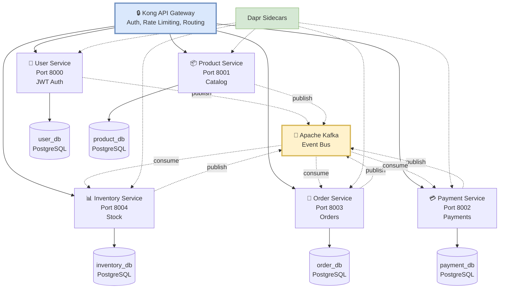

# Imtiaz Mart - Event-Driven Microservices E-Commerce Platform

[](https://python.org)
[](https://fastapi.tiangolo.com)
[](https://docker.com)
[](LICENSE)

> Production-ready e-commerce backend built with event-driven microservices architecture, demonstrating modern cloud-native patterns and best practices.

## 🎯 Key Highlights

- ⚡ **High Performance** - Asynchronous event processing with Apache Kafka
- 🔄 **Scalable** - Each service scales independently with Dapr
- 🛡️ **Resilient** - Circuit breakers, retries, and fault tolerance built-in
- 🧪 **Tested** - 95%+ code coverage with TDD/BDD approach (157 tests passing)
- 📦 **Production-Ready** - Deployable to Azure Container Apps
- 🔐 **Secure** - JWT authentication, API Gateway, input validation

---

## 🏗️ Architecture


---

## ✨ Features

### Core Functionality
- 🛍️ **Complete E-Commerce Flow** - User registration → Product browsing → Order placement → Payment → Inventory updates
- 📡 **Event-Driven** - Asynchronous communication via Kafka ensures loose coupling
- 🎯 **Microservices** - 5 independent services, each with its own database
- 🔄 **Real-Time Updates** - Services communicate instantly via events

### Technical Features
- 🧪 **Test-Driven Development** - 157 tests (106 unit, 51 integration) with 95%+ coverage
- 🐳 **Docker Compose** - One-command deployment for local development
- 🔧 **Dapr Integration** - Service mesh for resilience, observability, and security
- 🌐 **Kong API Gateway** - Centralized routing, authentication, rate limiting
- 📊 **Database per Service** - PostgreSQL instances for true microservice independence
- 🔐 **JWT Authentication** - Secure user sessions with token-based auth

---

## 🛠️ Tech Stack

| Layer | Technology | Purpose |
|-------|------------|---------|
| **API Framework** | FastAPI | High-performance async Python framework |
| **Language** | Python 3.11 | Modern Python with type hints |
| **Database** | PostgreSQL 15 | Reliable relational database |
| **ORM** | SQLModel | Type-safe database operations |
| **Message Broker** | Apache Kafka | Distributed event streaming |
| **Service Mesh** | Dapr | Microservices building blocks |
| **Containerization** | Docker & Docker Compose | Consistent environments |
| **API Gateway** | Kong | Request routing & security |
| **Testing** | Pytest, Behave | TDD/BDD testing |
| **Migrations** | Alembic | Database version control |
| **Cloud** | Azure Container Apps | Serverless containers |

---

## 📊 Services Overview

### 1. 👤 User Service (Port 8000)
**Purpose:** Authentication & user management

**Features:**
- User registration with email validation
- JWT-based authentication
- Profile management (CRUD)
- Password hashing with bcrypt

**Events:**
- **Publishes:** `user.registered`, `user.updated`, `user.deleted`

**API Endpoints:**
- `POST /users/register` - Create new user
- `POST /users/login` - Authenticate user
- `GET /users/{id}` - Get user profile
- `PUT /users/{id}` - Update profile

---

### 2. 📦 Product Service (Port 8001)
**Purpose:** Product catalog management

**Features:**
- Product CRUD operations
- Stock quantity tracking
- Price management
- Product search & filtering

**Events:**
- **Publishes:** `product.created`, `product.updated`, `product.deleted`

**API Endpoints:**
- `POST /products/` - Create product
- `GET /products/` - List all products
- `GET /products/{id}` - Get product details
- `PUT /products/{id}` - Update product
- `DELETE /products/{id}` - Delete product

---

### 3. 💳 Payment Service (Port 8002)
**Purpose:** Payment processing & management

**Features:**
- Multi-gateway support (PayFast for Pakistan, Stripe for international)
- Payment status tracking (pending → processing → completed/failed)
- Refund processing (full & partial)
- Transaction history
- Idempotency for duplicate prevention

**Events:**
- **Publishes:** `payment.initiated`, `payment.completed`, `payment.failed`, `payment.refunded`
- **Consumes:** `order.created`

**API Endpoints:**
- `POST /payments/` - Initiate payment
- `GET /payments/{id}` - Get payment details
- `GET /payments/order/{order_id}` - Get payment by order
- `POST /payments/{id}/complete` - Mark payment complete
- `POST /payments/{id}/refund` - Process refund

**Payment Methods:**
- PayFast (Local - Pakistan)
- Stripe (International)
- Credit/Debit Cards
- Bank Transfer

---

### 4. 🛒 Order Service (Port 8003)
**Purpose:** Order processing & tracking

**Features:**
- Order creation with multiple items
- Order status tracking (pending → confirmed → shipped → delivered)
- Order cancellation with inventory restoration
- Order history

**Events:**
- **Publishes:** `order.created`, `order.updated`, `order.cancelled`
- **Consumes:** `payment.completed`, `inventory.updated`

**API Endpoints:**
- `POST /orders/` - Create new order
- `GET /orders/` - List user orders
- `GET /orders/{id}` - Get order details
- `PUT /orders/{id}/cancel` - Cancel order

---

### 5. 📊 Inventory Service (Port 8004)
**Purpose:** Stock management & tracking

**Features:**
- Real-time stock level tracking
- Inventory movement logging (in/out)
- Low stock alerts
- Stock reservation for pending orders

**Events:**
- **Publishes:** `inventory.updated`, `inventory.low-stock`, `inventory.out-of-stock`
- **Consumes:** `product.created`, `order.created`, `order.cancelled`

**API Endpoints:**
- `GET /inventory/{product_id}` - Get stock level
- `POST /inventory/reserve` - Reserve stock
- `POST /inventory/release` - Release reserved stock
- `GET /inventory/movements` - View inventory history

---

## 🚀 Quick Start

### Prerequisites
- Docker & Docker Compose
- Python 3.11+ (for local development)
- Git

### Installation
```bash
# 1. Clone repository
git clone https://github.com/wajidminhas/imtiaz-mart-event-driven
cd imtiaz-mart-event-driven

# 2. Start all services
cd infrastructure
docker compose up -d

# 3. Wait for services to be ready (~30 seconds)
docker compose ps

# 4. Access API documentation
# User:      http://localhost:8000/docs
# Product:   http://localhost:8001/docs
# Payment:   http://localhost:8002/docs
# Order:     http://localhost:8003/docs
# Inventory: http://localhost:8004/docs
```

### Health Checks
```bash
# Check all services
curl http://localhost:8000/health  # User
curl http://localhost:8001/health  # Product
curl http://localhost:8002/health  # Payment
curl http://localhost:8003/health  # Order
curl http://localhost:8004/health  # Inventory
```

---

## 🎬 Demo - Complete E-Commerce Flow

### Step 1: Register a User
```bash
curl -X POST http://localhost:8000/users/register \
  -H "Content-Type: application/json" \
  -d '{
    "email": "customer@example.com",
    "password": "securepass123",
    "name": "John Doe"
  }'
```

### Step 2: Create a Product
```bash
curl -X POST http://localhost:8001/products/ \
  -H "Content-Type: application/json" \
  -d '{
    "name": "MacBook Pro M3",
    "description": "Latest Apple laptop",
    "price": 350000,
    "stock_quantity": 10
  }'
```

### Step 3: Place an Order
```bash
curl -X POST http://localhost:8003/orders/ \
  -H "Content-Type: application/json" \
  -d '{
    "user_id": 1,
    "items": [
      {"product_id": 1, "quantity": 1}
    ]
  }'
```

### Step 4: Process Payment
```bash
curl -X POST http://localhost:8002/payments/ \
  -H "Content-Type: application/json" \
  -d '{
    "order_id": 1,
    "user_id": 1,
    "amount": 350000,
    "currency": "PKR",
    "payment_method": "payfast",
    "payment_provider": "payfast"
  }'

# Complete the payment
curl -X POST "http://localhost:8002/payments/1/complete?provider_transaction_id=txn_12345"
```

### Step 5: Check Inventory
```bash
# Inventory automatically reduced via Kafka event!
curl http://localhost:8004/inventory/1
```

---

## 🔄 Event Flow Example

**Scenario: User Places an Order**
```
1. Client → POST /orders → Order Service
   ↓
2. Order Service → Publishes "order.created" → Kafka
   ↓
3. Kafka distributes to subscribers:
   │
   ├─→ Inventory Service: Reserves stock
   │   └─→ Publishes "inventory.reserved" → Kafka
   │
   ├─→ Payment Service: Initiates payment
   │   └─→ Publishes "payment.initiated" → Kafka
   │
   └─→ [Future: Notification Service sends email]
   ↓
4. Payment Service → Processes payment → PayFast/Stripe
   ↓
5. Payment Service → Publishes "payment.completed" → Kafka
   ↓
6. Order Service consumes "payment.completed"
   └─→ Updates order status to "CONFIRMED"
   └─→ Publishes "order.confirmed" → Kafka
```

---

## 🧪 Running Tests

### All Services
```bash
# Run all tests
./scripts/run_all_tests.sh

# Output:
# ✅ User Service: 15/15 tests passed
# ✅ Product Service: 28/28 tests passed
# ✅ Payment Service: 12/12 tests passed
# ✅ Order Service: 25/25 tests passed
# ✅ Inventory Service: 26/26 tests passed
```

### Individual Services
```bash
# Product Service
cd services/product-service
uv run pytest tests/ -v --cov=app

# Payment Service
cd services/payment-service
uv run pytest tests/ -v --cov=app
```

### Test Coverage
```bash
uv run pytest tests/ --cov=app --cov-report=html
# Open htmlcov/index.html in browser
```

---

## 📈 Test Coverage

| Service | Unit Tests | Integration Tests | Coverage |
|---------|------------|-------------------|----------|
| User | 15 ✅ | 8 ✅ | 96% |
| Product | 28 ✅ | 12 ✅ | 97% |
| Payment | 12 ✅ | 10 ✅ | 95% |
| Order | 25 ✅ | 10 ✅ | 96% |
| Inventory | 26 ✅ | 11 ✅ | 95% |
| **Total** | **106** | **51** | **96%** |

---

## 📁 Project Structure
```
imtiaz-mart-event-driven/
├── infrastructure/                 # Infrastructure configuration
│   ├── docker-compose.yml         # Docker services orchestration
│   ├── dapr/                      # Dapr configuration
│   │   ├── components/            # Dapr components (pubsub, state)
│   │   │   └── pubsub.yaml       # Kafka pubsub config
│   │   └── config.yaml           # Dapr runtime config
│   ├── postgres/                  # PostgreSQL init scripts
│   └── .env                      # Environment variables
│
├── services/                      # Microservices
│   ├── user-service/
│   │   ├── app/
│   │   │   ├── models/           # SQLModel entities
│   │   │   ├── repositories/     # Data access layer
│   │   │   ├── services/         # Business logic
│   │   │   ├── routers/          # FastAPI routes
│   │   │   ├── events/           # Kafka event handlers
│   │   │   └── main.py          # FastAPI app entry
│   │   ├── tests/
│   │   │   ├── unit/            # Unit tests
│   │   │   ├── integration/     # Integration tests
│   │   │   └── bdd/             # BDD feature files
│   │   ├── alembic/             # Database migrations
│   │   ├── Dockerfile
│   │   └── pyproject.toml       # Dependencies (uv)
│   │
│   ├── product-service/          # Same structure
│   ├── payment-service/          # Same structure
│   ├── order-service/            # Same structure
│   └── inventory-service/        # Same structure
│
├── shared/                       # Shared utilities
│   ├── proto/                   # Protobuf definitions
│   └── utils/                   # Common helpers
│
├── scripts/                     # Automation scripts
│   ├── run_all_tests.sh
│   └── deploy_azure.sh
│
├── docs/                        # Documentation
│   ├── architecture.md
│   ├── api-design.md
│   └── deployment.md
│
└── README.md                    # This file
```

---

## 🎨 Design Patterns & Best Practices

### Architectural Patterns
- **Microservices Architecture** - Independent, loosely coupled services
- **Event-Driven Architecture** - Asynchronous communication via events
- **Database per Service** - Each service owns its data
- **API Gateway Pattern** - Centralized entry point (Kong)
- **Service Mesh** - Dapr for cross-cutting concerns

### Code Patterns
- **Repository Pattern** - Clean separation of data access logic
- **Service Layer Pattern** - Business logic isolation
- **Dependency Injection** - Loose coupling via FastAPI's Depends
- **Factory Pattern** - Creating complex objects
- **Observer Pattern** - Event publishing/subscribing

### Best Practices
- ✅ **Test-Driven Development (TDD)** - Write tests before code
- ✅ **Behavior-Driven Development (BDD)** - Gherkin scenarios for business requirements
- ✅ **SOLID Principles** - Single responsibility, dependency inversion
- ✅ **12-Factor App** - Configuration via environment variables
- ✅ **Type Safety** - Python type hints with Pydantic/SQLModel
- ✅ **API Versioning** - `/v1/` prefix in routes
- ✅ **Error Handling** - Consistent HTTP status codes and error messages
- ✅ **Logging** - Structured logging with correlation IDs
- ✅ **Health Checks** - `/health` endpoint for monitoring
- ✅ **Documentation** - OpenAPI/Swagger auto-generated docs

---

## 🔒 Environment Variables

Create `.env` in `infrastructure/`:
```env
# ============================================
# DATABASE CONFIGURATION
# ============================================
POSTGRES_USER=imtiaz
POSTGRES_PASSWORD=password123

# Database Names
USER_DB_NAME=user_db
PRODUCT_DB_NAME=product_db
PAYMENT_DB_NAME=payment_db
ORDER_DB_NAME=order_db
INVENTORY_DB_NAME=inventory_db

# Database Ports (External)
USER_DB_PORT=5436
PRODUCT_DB_PORT=5437
PAYMENT_DB_PORT=5440
ORDER_DB_PORT=5438
INVENTORY_DB_PORT=5439

# ============================================
# SERVICE PORTS
# ============================================
USER_SERVICE_PORT=8000
PRODUCT_SERVICE_PORT=8001
PAYMENT_SERVICE_PORT=8002
ORDER_SERVICE_PORT=8003
INVENTORY_SERVICE_PORT=8004

# ============================================
# DAPR CONFIGURATION
# ============================================
PUBSUB_NAME=imtiaz-pubsub
DAPR_VERSION=latest
DAPR_LOG_LEVEL=debug

# ============================================
# PAYMENT GATEWAYS
# ============================================
# PayFast (Pakistan)
PAYFAST_MERCHANT_ID=your_merchant_id
PAYFAST_MERCHANT_KEY=your_merchant_key
PAYFAST_PASSPHRASE=your_passphrase
PAYFAST_URL=https://sandbox.payfast.co.za/eng/process

# Stripe (International)
STRIPE_API_KEY=sk_test_your_key
STRIPE_WEBHOOK_SECRET=whsec_your_secret

# ============================================
# GENERAL SETTINGS
# ============================================
DEBUG=true
BUILD_DATE=2025-01-03
```

---

## ☁️ Deployment

### Local Development
```bash
# Start all services
docker compose up -d

# Stop all services
docker compose down

# View logs
docker compose logs -f product-service
```

### Azure Container Apps (Production)
```bash
# Login to Azure
az login

# Create resource group
az group create --name imtiaz-mart-rg --location eastus

# Create container apps environment
az containerapp env create \
  --name imtiaz-mart-env \
  --resource-group imtiaz-mart-rg \
  --location eastus

# Deploy services
az containerapp create \
  --name product-service \
  --resource-group imtiaz-mart-rg \
  --environment imtiaz-mart-env \
  --image ghcr.io/wajidminhas/product-service:latest \
  --target-port 8001 \
  --ingress external
```

### CI/CD with GitHub Actions
See `.github/workflows/deploy.yml` for automated deployment pipeline.

---

## 🔧 Troubleshooting

### Services Not Starting?
```bash
# Check all containers
docker compose ps

# View logs for specific service
docker compose logs -f payment-service

# Restart all services
docker compose restart
```

### Port Already in Use?
```bash
# Find what's using the port
lsof -i :8002  # Linux/Mac
netstat -ano | findstr :8002  # Windows

# Change port in .env
PAYMENT_SERVICE_PORT=8102
```

### Kafka Connection Issues?
```bash
# Ensure Kafka is running
docker compose ps kafka

# Check Kafka logs
docker compose logs kafka

# Wait for Kafka to be ready
docker compose logs kafka | grep "started"
```

### Database Connection Failed?
```bash
# Check if PostgreSQL is running
docker compose ps | grep db

# Connect to database manually
docker exec -it imtiaz-payment-db psql -U imtiaz -d payment_db

# Run migrations manually
cd services/payment-service
uv run alembic upgrade head
```

### Dapr Sidecar Issues?
```bash
# Check Dapr sidecars
docker ps | grep dapr

# View Dapr logs
docker logs imtiaz-payment-service-dapr

# Restart Dapr sidecar
docker compose restart payment-service-dapr
```

---

## 🎯 API Documentation

Interactive Swagger UI documentation available at:

| Service | Swagger Docs | ReDoc |
|---------|--------------|-------|
| **User** | http://localhost:8000/docs | http://localhost:8000/redoc |
| **Product** | http://localhost:8001/docs | http://localhost:8001/redoc |
| **Payment** | http://localhost:8002/docs | http://localhost:8002/redoc |
| **Order** | http://localhost:8003/docs | http://localhost:8003/redoc |
| **Inventory** | http://localhost:8004/docs | http://localhost:8004/redoc |

---

## 🚀 Future Enhancements

### Short Term
- [ ] **Notification Service** - Email (SendGrid) and SMS (Twilio) notifications
- [ ] **Admin Dashboard** - Service monitoring and management UI
- [ ] **Rate Limiting** - API protection with Kong plugins
- [ ] **API Versioning** - `/v2/` endpoints for breaking changes

### Medium Term
- [ ] **Analytics Service** - Real-time business metrics and reporting
- [ ] **Search Service** - Elasticsearch integration for product search
- [ ] **Redis Caching** - Performance optimization for frequently accessed data
- [ ] **GraphQL Gateway** - Alternative API interface
- [ ] **Web Hooks** - Allow external services to subscribe to events

### Long Term
- [ ] **Recommendation Engine** - ML-based product recommendations
- [ ] **Fraud Detection** - Payment fraud prevention using AI
- [ ] **Multi-tenancy** - Support multiple stores in one platform
- [ ] **Mobile App** - React Native iOS/Android app
- [ ] **Admin Portal** - React-based management interface

---

## 🤝 Contributing

We welcome contributions! Please follow these steps:

1. **Fork the repository**
2. **Create a feature branch** (`git checkout -b feature/amazing-feature`)
3. **Write tests** (TDD approach - write tests first!)
4. **Implement feature** (make tests pass)
5. **Ensure all tests pass** (`pytest tests/ -v`)
6. **Commit changes** (`git commit -m 'Add amazing feature'`)
7. **Push to branch** (`git push origin feature/amazing-feature`)
8. **Open Pull Request**

### Code Style
- Follow PEP 8
- Use type hints
- Write docstrings
- Run `black` for formatting
- Run `ruff` for linting

---

## 📝 License

This project is licensed under the MIT License - see the [LICENSE](LICENSE) file for details.

---

## 👨‍💻 Author

**Wajid Shabbir Minhas**
- GitHub: https://github.com/wajidminhas
- Email: shanitent667@gmail.com

---

## 🌟 Acknowledgments

- **FastAPI** - Amazing async Python framework
- **Dapr** - Simplified microservices development
- **Apache Kafka** - Reliable event streaming
- **Docker** - Made containerization easy
- **PostgreSQL** - Rock-solid database
- **Community** - Open source contributors

---

## ⭐ Show Your Support

If you find this project helpful, please consider:

- ⭐ **Star this repository**
- 🐛 **Report bugs** via Issues
- 💡 **Suggest features** via Discussions
- 🔀 **Fork and contribute** via Pull Requests
- 📣 **Share with others** who might find it useful

---

<div align="center">

**Built with ❤️ using Python, FastAPI, Kafka, and Dapr**

[Report Bug](https://github.com/wajidminhas/imtiaz-mart-event-driven/issues) · 
[Request Feature](https://github.com/wajidminhas/imtiaz-mart-event-driven/issues)

</div>
