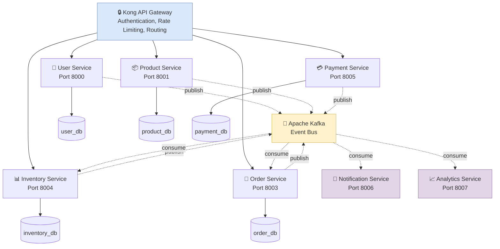

# Imtiaz Mart - Event-Driven Microservices

[](https://python.org)
[](https://fastapi.tiangolo.com)
[](https://docker.com)

Complete e-commerce platform built with event-driven microservices architecture.

## 🏗️ Architecture


## 🔗 Service Communication    

All services communicate through **Dapr service mesh** for reliability and scalability:

### Service-to-Service Calls
```
Order Service → Dapr (3503) → Product Service
✓ Service discovery (no hardcoded IPs)
✓ Automatic retries on failure
✓ Load balancing
```

### Event-Driven Communication
```
Services → Dapr → Apache Kafka → Dapr → Consumer Services
✓ Asynchronous processing
✓ Loose coupling
✓ Event replay capability
```

### Why Dapr?
- **Resilience**: Built-in retry logic and circuit breakers
- **Observability**: Distributed tracing out-of-the-box
- **Security**: mTLS encryption between services
- **Portability**: Switch between Kafka

## ✨ Features

- **Event-Driven Architecture** - Asynchronous communication via Kafka
- **Microservices** - Independent, scalable services
- **Test-Driven Development** - 95%+ test coverage
- **Docker Compose** - One-command deployment
- **Dapr Integration** - Service mesh for resilience
- **API Gateway** - Kong for centralized routing

## 🛠️ Tech Stack

| Layer | Technology |
|-------|------------|
| **API Framework** | FastAPI (Python 3.11) |
| **Database** | PostgreSQL 15 |
| **ORM** | SQLModel |
| **Message Broker** | Apache Kafka |
| **Service Mesh** | Dapr |
| **Containerization** | Docker Compose |
| **API Gateway** | Kong |
| **Testing** | Pytest (TDD/BDD) |
| **Cloud** | Azure Container Apps |

## 📊 Services Overview

### 1. User Service (Port 8000)
- User registration and login
- JWT authentication
- Profile management

### 2. Product Service (Port 8001)
- Product CRUD operations
- Catalog management
- **Publishes:** `product.created`, `product.updated`

### 3. Order Service (Port 8003)
- Order creation and tracking
- Order cancellation
- **Publishes:** `order.created`, `order.cancelled`
- **Consumes:** `product.*`, `payment.success`

### 4. Inventory Service (Port 8004)
- Stock management
- Movement tracking
- Low stock alerts
- **Publishes:** `inventory.low-stock`, `inventory.out-of-stock`
- **Consumes:** `product.created`, `order.created`, `order.cancelled`

### 5. Payment Service (Port 8005)
- Payment processing (PayFast + Stripe)
- Refund handling
- **Publishes:** `payment.success`, `payment.failed`
- **Consumes:** `order.created`

### 6. Notification Service (Port 8006)
- Email notifications (SendGrid)
- SMS alerts (Twilio)
- **Consumes:** All events

## 🚀 Quick Start
```bash
# Clone repository
git clone <https://github.com/wajidminhas/imtiaz-mart-event-driven>
cd imtiaz-mart-event-driven

# Start all services
cd infrastructure
docker compose up -d

# Check services
docker compose ps

# Access API documentation
# Product: http://localhost:8001/docs
# Order: http://localhost:8003/docs
# Inventory: http://localhost:8004/docs
```

## 🧪 Running Tests
```bash
# Product Service
cd services/product-service
uv run pytest tests/ -v

# Order Service
cd ../order-service
uv run pytest tests/ -v

# Inventory Service
cd ../inventory-service
uv run pytest tests/ -v
```

## 📁 Project Structure
```
imtiaz-mart-event-driven/
├── infrastructure/
│   ├── docker-compose.yml
│   ├── dapr/
│   │   ├── components/
│   │   │   └── pubsub.yaml
│   │   └── config.yaml
│   └── .env
├── services/
│   ├── product-service/
│   ├── order-service/
│   ├── inventory-service/
│   ├── user-service/
│   ├── payment-service/
│   └── notification-service/
└── README.md
```

## 🔄 Event Flow Example

**Creating an Order:**

1. Client → POST `/orders` → Order Service
2. Order Service → Publishes `order.created` → Kafka
3. Kafka distributes to:
   - Inventory Service: Reduces stock
   - Payment Service: Processes payment
   - Notification Service: Sends email
4. Payment Service → Publishes `payment.success` → Kafka
5. Order Service → Updates status to "confirmed"

## 🎯 API Documentation

Interactive Swagger docs available at:

- User: http://localhost:8000/docs
- Product: http://localhost:8001/docs
- Order: http://localhost:8003/docs
- Inventory: http://localhost:8004/docs
- Payment: http://localhost:8005/docs

## 📈 Test Coverage

| Service | Tests | Coverage |
|---------|-------|----------|
| Product | 28/28 ✅ | 95%+ |
| Order | 25/25 ✅ | 95%+ |
| Inventory | 26/26 ✅ | 95%+ |

## 🔒 Environment Variables

Create `.env` in `infrastructure/`:
```env
POSTGRES_USER=imtiaz
POSTGRES_PASSWORD=password123
PRODUCT_DB_NAME=product_db
ORDER_DB_NAME=order_db
INVENTORY_DB_NAME=inventory_db
DEBUG=true
```

## 🤝 Contributing

1. Fork the repository
2. Create feature branch
3. Write tests (TDD)
4. Submit pull request

## 📝 License

MIT License

## 👨‍💻 Author

**Wajid Shabbir Minhas**
- GitHub: https://github.com/wajidminhas
- Email: shanitent667@gmail.com

---

⭐ Star this repo if you find it helpful!
