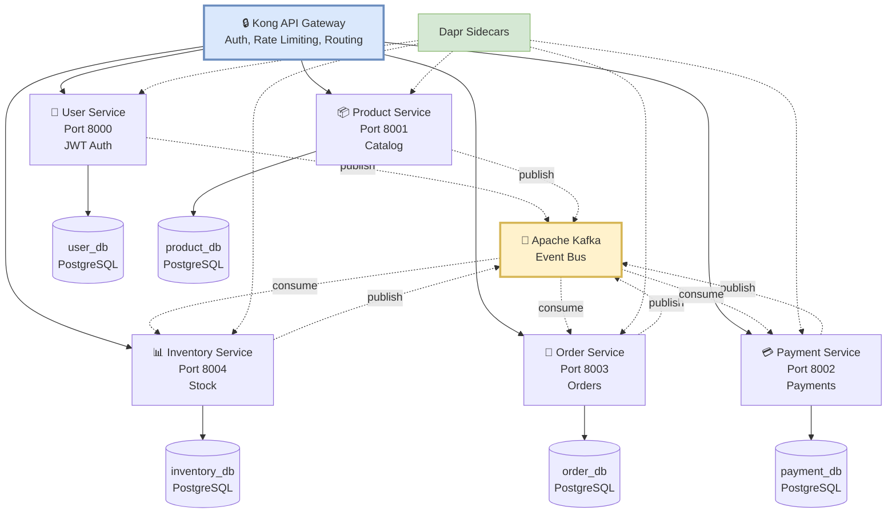

# Imtiaz Mart - Event-Driven Microservices E-Commerce Platform

[](https://python.org)
[](https://fastapi.tiangolo.com)
[](https://docker.com)
[](LICENSE)

> Production-ready e-commerce backend built with event-driven microservices architecture, demonstrating modern cloud-native patterns and best practices.

## 🎯 Key Highlights

- ⚡ **High Performance** - Asynchronous event processing with Apache Kafka
- 🔄 **Scalable** - Each service scales independently with Dapr
- 🛡️ **Resilient** - Circuit breakers, retries, and fault tolerance built-in
- 🧪 **Tested** - 95%+ code coverage with TDD/BDD approach (157 tests passing)
- 📦 **Production-Ready** - Deployable to Azure Container Apps
- 🔐 **Secure** - JWT authentication, API Gateway, input validation

---

## 🏗️ Architecture


---

## ✨ Features

### Core Functionality
- 🛍️ **Complete E-Commerce Flow** - User registration → Product browsing → Order placement → Payment → Inventory updates
- 📡 **Event-Driven** - Asynchronous communication via Kafka ensures loose coupling
- 🎯 **Microservices** - 5 independent services, each with its own database
- 🔄 **Real-Time Updates** - Services communicate instantly via events

### Technical Features
- 🧪 **Test-Driven Development** - 157 tests (106 unit, 51 integration) with 95%+ coverage
- 🐳 **Docker Compose** - One-command deployment for local development
- 🔧 **Dapr Integration** - Service mesh for resilience, observability, and security
- 🌐 **Kong API Gateway** - Centralized routing, authentication, rate limiting
- 📊 **Database per Service** - PostgreSQL instances for true microservice independence
- 🔐 **JWT Authentication** - Secure user sessions with token-based auth

---

## 🛠️ Tech Stack

| Layer | Technology | Purpose |
|-------|------------|---------|
| **API Framework** | FastAPI | High-performance async Python framework |
| **Language** | Python 3.11 | Modern Python with type hints |
| **Package Manager** | uv | Fast Python package and project manager |
| **Database** | PostgreSQL 16 | Reliable relational database |
| **ORM** | SQLModel | Type-safe database operations |
| **Message Broker** | Apache Kafka | Distributed event streaming |
| **Service Mesh** | Dapr | Microservices building blocks |
| **Containerization** | Docker & Docker Compose | Consistent environments |
| **API Gateway** | Kong | Request routing & security |
| **Testing** | Pytest, Behave | TDD/BDD testing |
| **Migrations** | Alembic | Database version control |
| **Cloud** | Azure Container Apps | Serverless containers |

---

## 📊 Services Overview

### 1. 👤 User Service (Port 8000)
**Purpose:** Authentication & user management

**Features:**
- User registration with email validation
- JWT-based authentication
- Profile management (CRUD)
- Password hashing with bcrypt

**Events:**
- **Publishes:** `user.registered`, `user.updated`, `user.deleted`

**API Endpoints:**
- `POST /users/register` - Create new user
- `POST /users/login` - Authenticate user
- `GET /users/{id}` - Get user profile
- `PUT /users/{id}` - Update profile

---

### 2. 📦 Product Service (Port 8001)
**Purpose:** Product catalog management

**Features:**
- Product CRUD operations
- Stock quantity tracking
- Price management
- Product search & filtering

**Events:**
- **Publishes:** `product.created`, `product.updated`, `product.deleted`

**API Endpoints:**
- `POST /products/` - Create product
- `GET /products/` - List all products
- `GET /products/{id}` - Get product details
- `PUT /products/{id}` - Update product
- `DELETE /products/{id}` - Delete product

---

### 3. 💳 Payment Service (Port 8002)
**Purpose:** Payment processing & management

**Features:**
- Multi-gateway support (PayFast for Pakistan, Stripe for international)
- Payment status tracking (pending → processing → completed/failed)
- Refund processing (full & partial)
- Transaction history
- Idempotency for duplicate prevention

**Events:**
- **Publishes:** `payment.initiated`, `payment.completed`, `payment.failed`, `payment.refunded`
- **Consumes:** `order.created`

**API Endpoints:**
- `POST /payments/` - Initiate payment
- `GET /payments/{id}` - Get payment details
- `GET /payments/order/{order_id}` - Get payment by order
- `POST /payments/{id}/complete` - Mark payment complete
- `POST /payments/{id}/refund` - Process refund

**Payment Methods:**
- PayFast (Local - Pakistan)
- Stripe (International)
- Credit/Debit Cards
- Bank Transfer

---

### 4. 🛒 Order Service (Port 8003)
**Purpose:** Order processing & tracking

**Features:**
- Order creation with multiple items
- Order status tracking (pending → confirmed → shipped → delivered)
- Order cancellation with inventory restoration
- Order history

**Events:**
- **Publishes:** `order.created`, `order.updated`, `order.cancelled`
- **Consumes:** `payment.completed`, `inventory.updated`

**API Endpoints:**
- `POST /orders/` - Create new order
- `GET /orders/` - List user orders
- `GET /orders/{id}` - Get order details
- `PUT /orders/{id}/cancel` - Cancel order

---

### 5. 📊 Inventory Service (Port 8004)
**Purpose:** Stock management & tracking

**Features:**
- Real-time stock level tracking
- Inventory movement logging (in/out)
- Low stock alerts
- Stock reservation for pending orders

**Events:**
- **Publishes:** `inventory.updated`, `inventory.low-stock`, `inventory.out-of-stock`
- **Consumes:** `product.created`, `order.created`, `order.cancelled`

**API Endpoints:**
- `GET /inventory/{product_id}` - Get stock level
- `POST /inventory/reserve` - Reserve stock
- `POST /inventory/release` - Release reserved stock
- `GET /inventory/movements` - View inventory history

---

## 🚀 Quick Start

### Prerequisites
- Docker & Docker Compose (or just `docker compose` for newer versions)
- Python 3.11+ (for local development)
- [uv](https://docs.astral.sh/uv/) - Fast Python package manager
- Git

### Installation

#### Option 1: Automated Setup (Recommended)
```bash
# 1. Clone repository
git clone https://github.com/wajidminhas/imtiaz-mart-event-driven
cd imtiaz-mart-event-driven

# 2. Full build and test
./build-and-test.sh full

# 3. Services will be running!
# Access API documentation at:
# - User:      http://localhost:8000/docs
# - Product:   http://localhost:8001/docs
# - Payment:   http://localhost:8002/docs
# - Order:     http://localhost:8003/docs
# - Inventory: http://localhost:8004/docs
```

#### Option 2: Manual Setup
```bash
# 1. Clone repository
git clone https://github.com/wajidminhas/imtiaz-mart-event-driven
cd imtiaz-mart-event-driven

# 2. Start all services
cd infrastructure
docker compose up -d

# 3. Wait for services to be ready (~30 seconds)
docker compose ps

# 4. Setup local development environment (optional)
cd ..
./setup-local.sh
```

### Health Checks
```bash
# Check all services
curl http://localhost:8000/health  # User
curl http://localhost:8001/health  # Product
curl http://localhost:8002/health  # Payment
curl http://localhost:8003/health  # Order
curl http://localhost:8004/health  # Inventory

# Or use the automated script
./build-and-test.sh health
```

---

## 🎬 Demo - Complete E-Commerce Flow

### Step 1: Register a User
```bash
curl -X POST http://localhost:8000/users/register \
  -H "Content-Type: application/json" \
  -d '{
    "email": "customer@example.com",
    "password": "securepass123",
    "name": "John Doe"
  }'
```

### Step 2: Create a Product
```bash
curl -X POST http://localhost:8001/products/ \
  -H "Content-Type: application/json" \
  -d '{
    "name": "MacBook Pro M3",
    "description": "Latest Apple laptop",
    "price": 350000,
    "stock_quantity": 10
  }'
```

### Step 3: Place an Order
```bash
curl -X POST http://localhost:8003/orders/ \
  -H "Content-Type: application/json" \
  -d '{
    "user_id": 1,
    "items": [
      {
        "product_id": 1,
        "quantity": 1,
        "price": 350000
      }
    ]
  }'
```

### Step 4: Process Payment
```bash
curl -X POST http://localhost:8002/payments/ \
  -H "Content-Type: application/json" \
  -d '{
    "order_id": 1,
    "amount": 350000,
    "payment_method": "credit_card"
  }'
```

---

## 🧪 Development Workflow

### Daily Development (No Rebuild)

```bash
# Morning - Start Docker services
cd infrastructure
docker compose up -d

# Code your changes in VSCode/editor
# Changes auto-sync via Docker volumes!

# Test locally (after creating local .venv)
cd services/product-service
uv run pytest tests/ -v

# End of day - Stop services
cd ../../infrastructure
docker compose down
```

### When to Rebuild

Rebuild is only needed when:
- ✅ Dockerfile changes
- ✅ New dependencies added to `pyproject.toml`
- ✅ Version updates

```bash
# Rebuild specific service
./build-and-test.sh build product-service

# Rebuild all services
./build-and-test.sh build

# Full rebuild with tests
./build-and-test.sh full
```

### Local Development Environment Setup

```bash
# Install uv (if not already installed)
curl -LsSf https://astral.sh/uv/install.sh | sh

# Setup local .venv for all services
./setup-local.sh

# Or manually for one service
cd services/product-service
uv venv
uv sync

# Run tests
uv run pytest tests/ -v

# Run with coverage
uv run pytest tests/ --cov=app --cov-report=html
```

---

## 🛠️ Build & Test Scripts

### Available Commands

```bash
# Build all services
./build-and-test.sh build

# Build specific service
./build-and-test.sh build product-service

# Run all tests
./build-and-test.sh test

# Test specific service
./build-and-test.sh test user-service

# Start services
./build-and-test.sh start

# Stop services
./build-and-test.sh stop

# Check health
./build-and-test.sh health

# Full workflow (build + start + test)
./build-and-test.sh full

# Quick test (no rebuild)
./build-and-test.sh quick

# Clean Docker resources
./build-and-test.sh clean

# Setup local development environment
./build-and-test.sh setup
```

### Version Management

```bash
# Build with patch version bump (1.0.0 → 1.0.1)
./build-and-test.sh build --patch

# Build with minor version bump (1.0.0 → 1.1.0)
./build-and-test.sh build --minor

# Build with major version bump (1.0.0 → 2.0.0)
./build-and-test.sh build --major

# Build with specific version
VERSION=1.2.3 ./build-and-test.sh build
```

### Complete Rebuild

For a fresh start (removes all images and rebuilds):

```bash
./rebuild-all.sh
```

---

## 📁 Project Structure

```
imtiaz-mart-event-driven/
├── 📄 build-and-test.sh          # Automated build & test script
├── 📄 rebuild-all.sh             # Complete rebuild script
├── 📄 setup-local.sh             # Setup local development .venv
├── 📄 README.md                   # This file
├── 📄 .gitignore                  # Git ignore rules
│
├── 📁 services/
│   ├── product-service/
│   │   ├── app/
│   │   │   ├── main.py           # FastAPI application
│   │   │   ├── models.py         # SQLModel models
│   │   │   ├── routes.py         # API endpoints
│   │   │   ├── database.py       # Database connection
│   │   │   └── events.py         # Kafka event handlers
│   │   ├── tests/
│   │   │   ├── unit/             # Unit tests
│   │   │   └── integration/      # Integration tests
│   │   ├── Dockerfile            # Uses uv for dependencies
│   │   ├── .dockerignore         # Excludes .venv, tests, etc.
│   │   ├── pyproject.toml        # Dependencies
│   │   └── uv.lock               # Locked dependencies
│   │
│   ├── user-service/             # Same structure
│   ├── order-service/            # Same structure
│   ├── inventory-service/        # Same structure
│   └── payment-service/          # Same structure
│
└── 📁 infrastructure/
    ├── docker-compose.yml        # All services definition
    ├── .env                      # Environment variables
    ├── .env.example              # Environment template
    └── dapr/
        ├── components/           # Dapr components config
        └── config.yaml           # Dapr configuration
```

---

## 🔧 Key Technical Decisions

### Docker Configuration

#### Dockerfiles
All services use a standardized Dockerfile:

```dockerfile
FROM python:3.11-slim

WORKDIR /app

# Install uv
COPY --from=ghcr.io/astral-sh/uv:latest /uv /usr/local/bin/uv

# Copy everything
COPY . .

# Install dependencies
RUN uv sync

EXPOSE <PORT>

# Use uv run
CMD ["uv", "run", "uvicorn", "app.main:app", "--host", "0.0.0.0", "--port", "<PORT>", "--reload"]
```

#### .dockerignore
Each service has a `.dockerignore` to keep images clean:

```
.venv/
__pycache__/
*.pyc
.pytest_cache/
.coverage
.git/
.gitignore
.env
*.md
tests/
.vscode/
.idea/
```

### Volume Mounts

Docker Compose uses volume mounts for live code reloading:

```yaml
volumes:
  - ../services/product-service:/app
```

**Important:** Docker will create `.venv` inside containers. For local testing, remove it and create your own:

```bash
sudo rm -rf services/*/.venv
./setup-local.sh
```

### uv Package Manager

We use [uv](https://docs.astral.sh/uv/) instead of pip because:
- ⚡ **10-100x faster** than pip
- 🔒 **Deterministic** with uv.lock
- 📦 **Better dependency resolution**
- 🚀 **Built-in virtual env management**

---

## 🏛️ Architecture Patterns

### Design Patterns
- **Event-Driven Architecture** - Services communicate via events
- **CQRS (Command Query Responsibility Segregation)** - Separate read/write operations
- **Saga Pattern** - Distributed transactions (order → payment → inventory)
- **Circuit Breaker** - Fault tolerance via Dapr
- **Database per Service** - Data isolation and independence
- **API Gateway** - Single entry point with Kong
- **Repository Pattern** - Data access abstraction
- **Dependency Injection** - FastAPI's dependency system
- **Observer Pattern** - Event publishing/subscribing

### Best Practices
- ✅ **Test-Driven Development (TDD)** - Write tests before code
- ✅ **Behavior-Driven Development (BDD)** - Gherkin scenarios for business requirements
- ✅ **SOLID Principles** - Single responsibility, dependency inversion
- ✅ **12-Factor App** - Configuration via environment variables
- ✅ **Type Safety** - Python type hints with Pydantic/SQLModel
- ✅ **API Versioning** - `/v1/` prefix in routes
- ✅ **Error Handling** - Consistent HTTP status codes and error messages
- ✅ **Logging** - Structured logging with correlation IDs
- ✅ **Health Checks** - `/health` endpoint for monitoring
- ✅ **Documentation** - OpenAPI/Swagger auto-generated docs

---

## 🔒 Environment Variables

Create `.env` in `infrastructure/`:

```env
# ============================================
# DATABASE CONFIGURATION
# ============================================
POSTGRES_USER=imtiaz
POSTGRES_PASSWORD=password123

# Database Names
USER_DB_NAME=user_db
PRODUCT_DB_NAME=product_db
PAYMENT_DB_NAME=payment_db
ORDER_DB_NAME=order_db
INVENTORY_DB_NAME=inventory_db

# Database Ports (External)
USER_DB_PORT=5436
PRODUCT_DB_PORT=5437
PAYMENT_DB_PORT=5440
ORDER_DB_PORT=5438
INVENTORY_DB_PORT=5439

# ============================================
# SERVICE PORTS
# ============================================
USER_SERVICE_PORT=8000
PRODUCT_SERVICE_PORT=8001
PAYMENT_SERVICE_PORT=8002
ORDER_SERVICE_PORT=8003
INVENTORY_SERVICE_PORT=8004

# ============================================
# DAPR CONFIGURATION
# ============================================
PUBSUB_NAME=imtiaz-pubsub
DAPR_VERSION=latest
DAPR_LOG_LEVEL=debug

# ============================================
# PAYMENT GATEWAYS
# ============================================
# PayFast (Pakistan)
PAYFAST_MERCHANT_ID=your_merchant_id
PAYFAST_MERCHANT_KEY=your_merchant_key
PAYFAST_PASSPHRASE=your_passphrase
PAYFAST_URL=https://sandbox.payfast.co.za/eng/process

# Stripe (International)
STRIPE_API_KEY=sk_test_your_key
STRIPE_WEBHOOK_SECRET=whsec_your_secret

# ============================================
# GENERAL SETTINGS
# ============================================
DEBUG=true
BUILD_DATE=2025-01-03
VERSION=1.0.0
```

---

## ☁️ Deployment

### Local Development
```bash
# Start all services
cd infrastructure
docker compose up -d

# Stop all services
docker compose down

# View logs
docker compose logs -f product-service

# Restart specific service
docker compose restart product-service
```

### Azure Container Apps (Production)
```bash
# Login to Azure
az login

# Create resource group
az group create --name imtiaz-mart-rg --location eastus

# Create container apps environment
az containerapp env create \
  --name imtiaz-mart-env \
  --resource-group imtiaz-mart-rg \
  --location eastus

# Deploy services
az containerapp create \
  --name product-service \
  --resource-group imtiaz-mart-rg \
  --environment imtiaz-mart-env \
  --image ghcr.io/wajidminhas/product-service:latest \
  --target-port 8001 \
  --ingress external
```

### CI/CD with GitHub Actions
See `.github/workflows/deploy.yml` for automated deployment pipeline.

---

## 🔧 Troubleshooting

### Services Not Starting?
```bash
# Check all containers
docker compose ps

# View logs for specific service
docker compose logs -f payment-service

# Restart all services
docker compose restart

# Use build script to check health
./build-and-test.sh health
```

### Permission Denied on .venv?
```bash
# Docker created .venv as root, remove it
sudo rm -rf services/*/.venv

# Create local .venv (owned by you)
./setup-local.sh

# Or manually
cd services/product-service
uv venv
uv sync
```

### Port Already in Use?
```bash
# Find what's using the port
sudo lsof -i :8002  # Linux/Mac
netstat -ano | findstr :8002  # Windows

# Change port in .env
PAYMENT_SERVICE_PORT=8102

# Restart services
cd infrastructure
docker compose down
docker compose up -d
```

### Kafka Connection Issues?
```bash
# Ensure Kafka is running
docker compose ps kafka

# Check Kafka logs
docker compose logs kafka

# Wait for Kafka to be ready
docker compose logs kafka | grep "started"
```

### Database Connection Failed?
```bash
# Check if PostgreSQL is running
docker compose ps | grep db

# Connect to database manually
docker exec -it imtiaz-payment-db psql -U imtiaz -d payment_db

# Run migrations manually
cd services/payment-service
uv run alembic upgrade head
```

### Dapr Sidecar Issues?
```bash
# Check Dapr sidecars
docker ps | grep dapr

# View Dapr logs
docker logs imtiaz-payment-service-dapr

# Restart Dapr sidecar
docker compose restart payment-service-dapr
```

### Build Failing?
```bash
# Clean everything and rebuild
./rebuild-all.sh

# Or manually
docker compose down --volumes
docker image prune -a -f
sudo rm -rf services/*/.venv
./build-and-test.sh build
```

### Network Issues with ghcr.io?
```bash
# Update DNS to use Google DNS
sudo bash -c 'cat > /etc/resolv.conf << EOF
nameserver 8.8.8.8
nameserver 8.8.4.4
nameserver 1.1.1.1
EOF'

# Test if ghcr.io is reachable
ping -c 3 ghcr.io

# Pull uv image manually
docker pull ghcr.io/astral-sh/uv:latest
```

---

## 🎯 API Documentation

Interactive Swagger UI documentation available at:

| Service | Swagger Docs | ReDoc |
|---------|--------------|-------|
| **User** | http://localhost:8000/docs | http://localhost:8000/redoc |
| **Product** | http://localhost:8001/docs | http://localhost:8001/redoc |
| **Payment** | http://localhost:8002/docs | http://localhost:8002/redoc |
| **Order** | http://localhost:8003/docs | http://localhost:8003/redoc |
| **Inventory** | http://localhost:8004/docs | http://localhost:8004/redoc |

---

## 🚀 Future Enhancements

### Short Term
- [ ] **Notification Service** - Email (SendGrid) and SMS (Twilio) notifications
- [ ] **Admin Dashboard** - Service monitoring and management UI
- [ ] **Rate Limiting** - API protection with Kong plugins
- [ ] **API Versioning** - `/v2/` endpoints for breaking changes

### Medium Term
- [ ] **Analytics Service** - Real-time business metrics and reporting
- [ ] **Search Service** - Elasticsearch integration for product search
- [ ] **Redis Caching** - Performance optimization for frequently accessed data
- [ ] **GraphQL Gateway** - Alternative API interface
- [ ] **Web Hooks** - Allow external services to subscribe to events

### Long Term
- [ ] **Recommendation Engine** - ML-based product recommendations
- [ ] **Fraud Detection** - Payment fraud prevention using AI
- [ ] **Multi-tenancy** - Support multiple stores in one platform
- [ ] **Mobile App** - React Native iOS/Android app
- [ ] **Admin Portal** - React-based management interface

---

## 🤝 Contributing

We welcome contributions! Please follow these steps:

1. **Fork the repository**
2. **Create a feature branch** (`git checkout -b feature/amazing-feature`)
3. **Write tests** (TDD approach - write tests first!)
4. **Implement feature** (make tests pass)
5. **Ensure all tests pass** (`./build-and-test.sh test`)
6. **Commit changes** (`git commit -m 'Add amazing feature'`)
7. **Push to branch** (`git push origin feature/amazing-feature`)
8. **Open Pull Request**

### Code Style
- Follow PEP 8
- Use type hints
- Write docstrings
- Run `black` for formatting
- Run `ruff` for linting

### Testing
```bash
# Run all tests
./build-and-test.sh test

# Test specific service
./build-and-test.sh test product-service

# Run with coverage
cd services/product-service
uv run pytest tests/ --cov=app --cov-report=html
```

---

## 📝 License

This project is licensed under the MIT License - see the [LICENSE](LICENSE) file for details.

---

## 👨‍💻 Author

**Wajid Shabbir Minhas**
- GitHub: https://github.com/wajidminhas
- Email: shanitent667@gmail.com

---

## 🌟 Acknowledgments

- **FastAPI** - Amazing async Python framework
- **uv** - Fast and reliable Python package manager
- **Dapr** - Simplified microservices development
- **Apache Kafka** - Reliable event streaming
- **Docker** - Made containerization easy
- **PostgreSQL** - Rock-solid database
- **Community** - Open source contributors

---

## ⭐ Show Your Support

If you find this project helpful, please consider:

- ⭐ **Star this repository**
- 🐛 **Report bugs** via Issues
- 💡 **Suggest features** via Discussions
- 🔀 **Fork and contribute** via Pull Requests
- 📣 **Share with others** who might find it useful

---

## 📚 Additional Resources

### Documentation
- [FastAPI Documentation](https://fastapi.tiangolo.com/)
- [uv Documentation](https://docs.astral.sh/uv/)
- [Dapr Documentation](https://docs.dapr.io/)
- [Docker Compose Documentation](https://docs.docker.com/compose/)
- [PostgreSQL Documentation](https://www.postgresql.org/docs/)

### Tutorials Used
- Event-Driven Microservices
- CQRS and Event Sourcing
- Docker Multi-Stage Builds
- FastAPI Best Practices
- Kafka Event Streaming

---

<div align="center">

**Built with ❤️ using Python, FastAPI, uv, Kafka, and Dapr**

[Report Bug](https://github.com/wajidminhas/imtiaz-mart-event-driven/issues) · 
[Request Feature](https://github.com/wajidminhas/imtiaz-mart-event-driven/issues) ·
[View Demo](https://github.com/wajidminhas/imtiaz-mart-event-driven)

</div>
